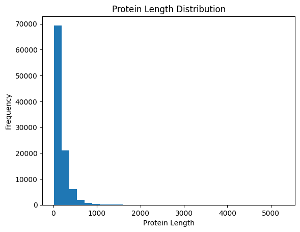

# Protein Sequence Feature Analysis using PySpark

## 👥 Team Members
- [Noor ul Huda]
- [Maryam Ashraf]
- [Amna Zulfiqar]


---

# 📌 Project Overview

This project implements a distributed bioinformatics pipeline using Apache Spark (PySpark) to analyze protein sequence data from the UniProt proteome database.

The pipeline processes compressed FASTA protein datasets and extracts multiple biological features including:

- Protein length statistics
- Amino acid composition
- Motif frequency analysis
- Protein family-level summaries

The project demonstrates how distributed computing frameworks such as Spark can efficiently process large-scale biological sequence datasets.

---

# 🎯 Objective

The objective of this project is to design and implement a scalable bioinformatics pipeline capable of performing distributed protein sequence analysis using PySpark.

The pipeline demonstrates:

- Distributed data ingestion
- Parallel feature extraction
- Spark DataFrame transformations
- Aggregation and summarization
- Biological interpretation of results

---

# 🧬 Dataset Information

## Dataset Used
UniProt Proteome FASTA Dataset

## Source
https://www.uniprot.org/proteomes/UP000000625

## Dataset ID
UP000000625

## Organism
*Escherichia coli*

## File Type
Compressed FASTA file (`.fasta.gz`)

## Dataset Structure

Each FASTA record contains:

- Protein header / annotation
- Amino acid sequence

Example:

```text
>Protein_Header
MSEQUENCE....
```

---

# ⚙️ Technologies and Libraries Used

## Framework
- Apache Spark (PySpark)

## Programming Language
- Python

## Libraries
- gzip
- pyspark
- matplotlib
- pandas
- findspark

---

# 🔄 Pipeline Workflow

## 1. Dataset Ingestion
The compressed FASTA dataset was loaded directly using Python's gzip module without manual extraction.

## 2. FASTA Parsing
Protein headers and amino acid sequences were parsed and converted into structured records.

## 3. Spark DataFrame Creation
Parsed protein records were converted into a Spark DataFrame for distributed processing.

## 4. Feature Extraction
The following biological features were extracted:

- Protein sequence length
- Amino acid composition
- Motif counts
- Protein family classification

## 5. Distributed Processing
Spark distributed operations were applied including:

- DataFrame transformations
- repartitioning
- caching
- groupBy aggregations
- distributed feature extraction using UDFs

## 6. Visualization and Analysis
Results were visualized using histograms, bar charts, and pie charts.

---

# 🚀 Distributed Computing Features

The project demonstrates several distributed computing concepts using Apache Spark.

## Spark DataFrame Operations
Protein sequences were processed using distributed Spark DataFrames.

## UDF-Based Parallel Feature Extraction
Custom User Defined Functions (UDFs) were used to extract amino acid and motif information in parallel.

## Repartitioning
The dataset was repartitioned to improve parallel processing performance.

```python
df = df.repartition(4)
```

## Caching
Spark caching was applied to optimize repeated computations.

```python
df.cache()
```

## Distributed Aggregations
`groupBy()` and aggregation operations were used for family-level and motif-level summaries.

---

# 📊 Results and Visualizations

---

# 1. Protein Length Distribution

The distribution of protein sequence lengths was analyzed across the proteome.

## Visualization



## Statistical Summary

- Average protein length: ~176 amino acids
- Protein lengths varied significantly across sequences
- A small number of proteins were substantially longer than the majority

## Interpretation

The histogram shows that most proteins fall within a moderate sequence length range, while a smaller subset contains very long proteins. This indicates functional diversity within the proteome, where different proteins serve specialized biological roles.

---

# 2. Protein Family Distribution

Proteins were categorized into families using keyword-based classification from FASTA headers.

## Categories
- Ribosomal
- Transport
- Other

## Visualization


## Observed Counts

| Family | Count |
|---|---|
| Other | 93949 |
| Ribosomal | 382 |
| Transport | Smaller proportion |

## Interpretation

The majority of proteins belonged to the "Other" category due to the wide diversity of bacterial proteins. Ribosomal proteins formed a smaller but biologically significant group, reflecting their essential role in protein synthesis.

---

# 3. Amino Acid Composition Analysis

The frequency of amino acids across the proteome was calculated.

## Visualization


## Interpretation

Amino acid frequencies varied across the dataset, indicating differences in structural and functional protein properties. Certain amino acids appeared more frequently, reflecting organism-specific protein composition patterns.

---

# 4. Motif Frequency Analysis

Motif patterns were identified and counted across protein sequences.

## Motifs Analyzed
- AAA
- GGG
- KKK

## Motif Counts

| Motif | Count |
|---|---|
| AAA | 14556 |
| GGG | 7292 |
| KKK | 2521 |

## Visualization


## Interpretation

Recurring motifs indicate conserved sequence patterns that may be associated with structural or functional properties in proteins. The AAA motif appeared most frequently among the analyzed motifs.

---

# 🧠 Biological Insights

The analysis demonstrates that protein datasets contain substantial biological diversity in terms of sequence length, amino acid usage, and recurring motifs.

## Key Observations

- Protein lengths vary widely across the proteome
- Amino acid composition reflects organism-specific proteomic characteristics
- Certain motifs occur more frequently than others
- Ribosomal proteins represent an important conserved protein family

The project also demonstrates how distributed computing can efficiently process biological sequence data at scale.

---

# ▶️ How to Run the Project

## Step 1
Open Google Colab.

## Step 2
Install Spark dependencies.

## Step 3
Upload the compressed FASTA dataset.

## Step 4
Run notebook cells sequentially.

---


# 📌 Output Files

The project generates:

- Protein length distribution plots
- Family distribution pie charts
- Amino acid composition visualizations
- Motif frequency visualizations
- Spark summary tables

---

# 📚 References

## UniProt
https://www.uniprot.org/

## Apache Spark
https://spark.apache.org/

## PySpark Documentation
https://spark.apache.org/docs/latest/api/python/

---

# 👥 Contribution Statement

| Member | Contribution |
|---|---|
| Amna Zulfiqar | Dataset collection and preprocessing ,Spark implementation|
| Maryam Ashraf | distributed operations and  Visualization |
| Noor ul Huda  | result analysis and Documentation|


---

# ✅ Conclusion

This project successfully demonstrates a scalable protein sequence analysis pipeline using Apache Spark. The workflow combines biological feature extraction with distributed computing techniques to efficiently process proteomic data and generate meaningful biological insights.
